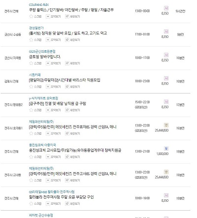
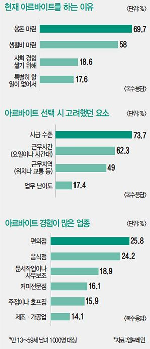
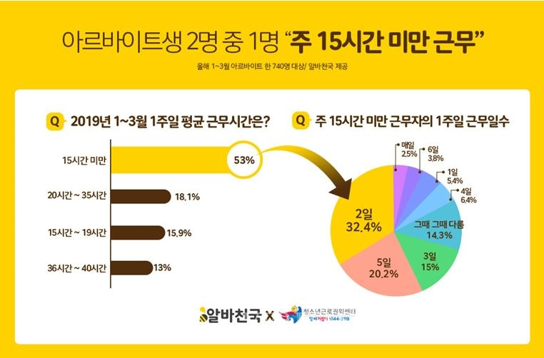
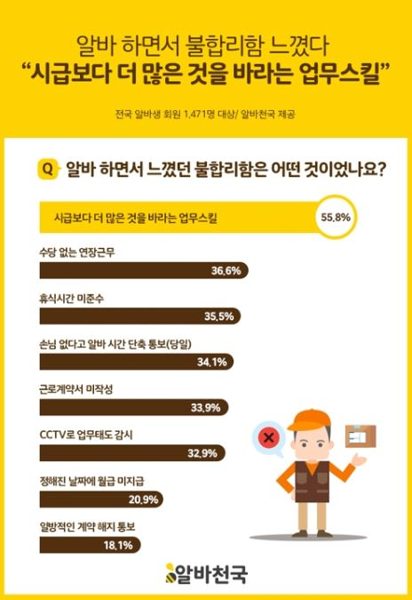
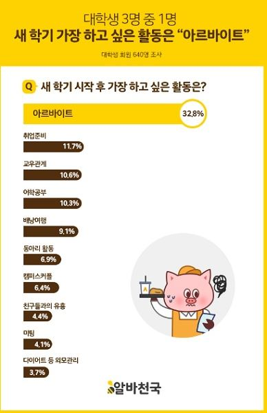

Big Data analysis project (web crawling)
=============

contents
-------------

1. Why?
2. Idea
3. Method
4. Data
5. Other

### 1.Why?

### 대학생이라면 한번쯤은 찾아보는 아르바이트

#### 자리에 따라 편하고 시급이 높은 좋은 아르바이트

#### 최저시급을 안챙겨주거나 매우 힘든 아르바이트 등

#### 여러가지 아르바이트들은 분야가 넓고 추세를 반영한다.

#### 이에따라 아르바이트에 대한 정보를 추합하고 트렌드를 파악할 수 있게 데이터베이스를 구축한다.

>위 사진은 실제 알바천국 사이트에 들어 갈 경우 보이는 구인 글이다.

>보는것과 같이 간단한 정보와 내용만 전달이 되고 세부 내용을 보려면 한번 더 사이트에 접속을 해야한다.

>위와 같은 형태이기 때문에 특정 아르바이트를 구할 때 여러 조건을 동시에 비교하기에 어려움이 있다.

>아르바이트를 구하는 이유 선택 요소에 관련된 그래프 이다.

>그래프를 보면 시급 / 근무시간 / 근무지역 / 업무 난이도 같은 것들을 비교해서 아르바이트를 결정하는 것을 알 수 있다.

>맨 위에서 보는 사진으론 시급이외엔 알아낼 방법이 없다.

>따라서 한눈에 볼 수 있게 필요로하는 정보를 데이터로 보관한다.

>관련 기사를 검색해 보았을 때 알 수 있는 사진이다.

>실제 대학생들이 아르바이트에 얼마나 관심이 많은지를 알 수 있는 사진이다.

>해당 그래프들을 통해 실제 대학생들이 필요로하는 자료가 무엇인지 알아보고자 한다.

### 2.Idea

>Web crawling방법을 사용하여
>알바몬, 알바천국과 같은 곳에서 데이터를 모은다

>각종 아르바이트 구인글에 접속하여 자료를 수집한다.

>모은 데이터를 가지고 분석한다.

### 3. Method

>R Program을 이용하여 web crawling을 통해 알바천국 홈페이지 구인글의 주소를 수집한다.

>R package rvest & taskscheduleR을 이용

>주소에 접근하여 세부사항을 보기좋게 자료를 전처리한 뒤 시간에 맞게 저장한다.

>1시간 마다 자료를 수집한 후 csv파일에 누적시킨다.

### 4. Data

>크롤링하는 자료 : 주소/내용/근무시간/금액/ 구인글이 올라온 시간 / 경력 / 나이 / 학력 / 근무형태

>모집인원 / 근무기간 / 근무요일 / 구인기간 / 장소

### 5.Problem

>50~150회 가량의 자료를 알바천국에서 수집할 경우 ip가 2시간 동안 차단당한다.

>이에 따라 적은양의 자료를 수시로 수집한다.

### 6. schedule

##### 2019/4/4

>rvest 사용법과 어떠한 정보가 현재 알바구직 사이트에 존재하는지를 조사해보았다.

##### 2019/4/7

>유용한 정보가 무엇인지 내부 XML구조와 정규표현식을 통해 데이터 전처리 방법을 어떻게 할지 찾아보았다.

##### 2019/4/8
>전처리 과정과 이를 더 효율적으로 저장 / 관리 및 데이터를 모으는 방법을 정리 중이다.

##### 2019/4/9

>taskscheduleR를 이용하여 주기적으로 R 프로그램을 자동으로 실행하는 방법을 익혔다.

##### 2019/4/11

>test file을 생성 및 관리하는 방법을 알아보고 만들어 보았다.

>alpha version complete

>구축중인 데이터셋 : 아르바이트 기준
>장소, 내용 , 시간, 월급, 구인시작시간, 경력, 성별, 나이, 약력, 고용형태, 모집인원, 근무기간, 근무요일

##### 2019/4/16

>beta version complete
>근무지 주소와 구인 기간 추가 
>코드를 일반화 시켰다.

##### 2019/5/02

>2시간 마다 ip 차단이 풀리는 것을 확인.
>매 시간마다 정보를 크롤링하여 데이터를 구축해나간다.

##### 2019/5/06 ~

>실제 코드를 완성한 뒤 자료를 수집하는 중이다.
>데이터 전처리 과정의 일반화 
