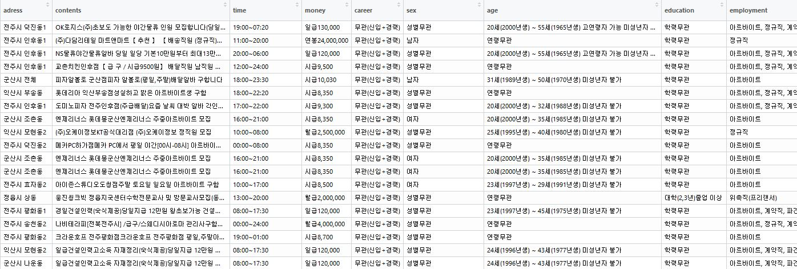
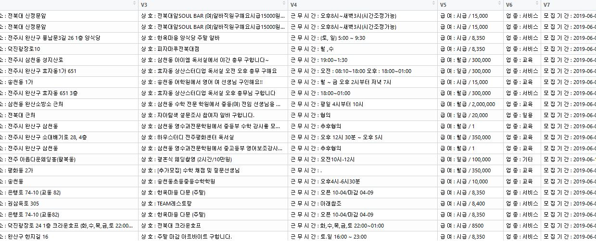
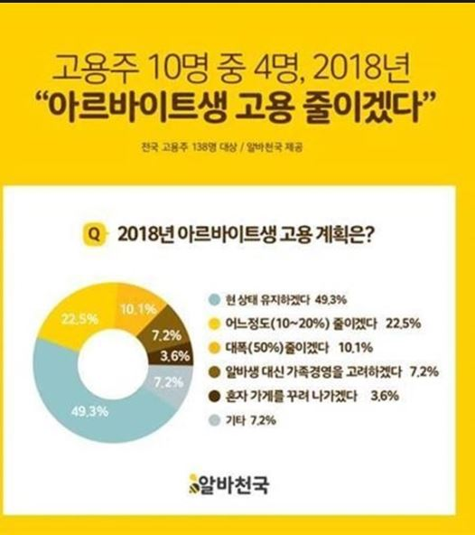
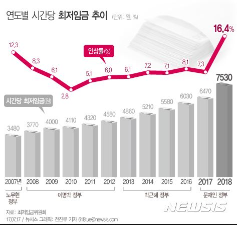
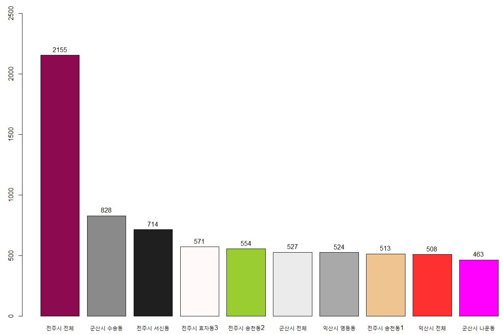
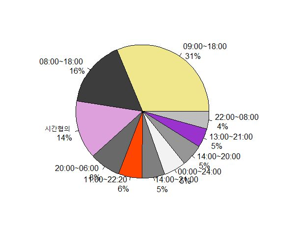
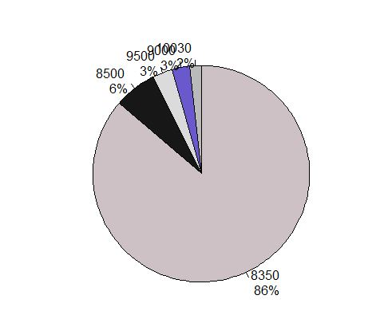

##### 최종 발표

현재 진행상황 및 자료의 방향성과 프로젝트 설계

#### 1. Data
# (위 데이터는 전주시 데이터만을 가지고 다뤘습니다.)

2019/5/6 ~ 2019/6/10 까지 약 16000여개의 아르바이트 구인 정보를 알바천국에서 취합

2019/1/1 ~ 2019/6/10 까지 약 13000여개의 아르바이트 구인 정보를 전북대학교 구인/구직 탭에서 취합

#### 2. 방향성 및 하고 싶은 일

여러 기사들을 보면 알 수 있듯이 작년 최저시급이 오름에 따라 아르바이트 자리는 급격히 줄어들고 무인기계가 들어오는 등
아르바이트로 여러가지 사회현상을 관찰해볼 수 있다.

국가 경제가 안좋을때 아르바이트 구인글의 감소라던지 평균 임금이 줄어든다던지 이러한 현상들을 알아보고자 한다.

국가 경제지표에 따라 경제가 활성화 되거나 악화되었을때 변화하는 아르바이트 구인사이트에 변화가 어떤것들이 이루어지는지

또한 연별 계절별 월별 아르바이트 구인에 어떠한 의미있는 차이점이 있는지를 지속적으로 관찰해본다.

가장 점유율이 높은 알바천국과 전북대학교 홈페이지에 나오는 구인/구직 글이 얼마나 차이가 있는지 알아보고 서로 비교해본다.

#### 문제점

데이터 전처리과정에서 필요한 정보로 수정하는게 매우 까다롭다.

갑자기 아르바이트 구인글이 많아져 ip가 차단을 당하는 경우 

#### 분석 방향

알바천국과 전북대학교 아르바이트 구인/구직 글에 차이점을 비교하고 각 사이트마다 서로 다른 특징은 무엇이고 어떤형식으로 다른지 알아본다.

